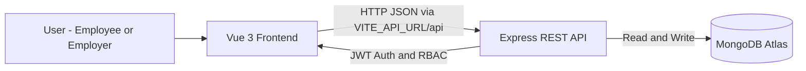

## Leave Management Application

A simple leave management web app where **employees** can apply for leave and **employers** can review and approve or reject those requests.

### Tech stack

- **Frontend**: Vue 3, Vite, Vue Router, Tailwind CSS  
- **Backend**: Node.js, Express, JWT, Mongoose  
- **Database**: MongoDB Atlas  

### High-level flow (Mermaid)



### Main features

- **Authentication**: JWT-based login/registration with roles (`employee`, `employer`)
- **Employees**:
  - Register and log in
  - Apply for leave (type, start date, end date, reason)
  - View status: pending, approved, rejected
- **Employers**:
  - View all employee leave requests
  - Approve or reject requests

### REST API

Base URL: `VITE_API_URL + /api` (e.g. `http://localhost:5000/api` in development)

| Method | Endpoint                  | Auth | Role              | Description                                  |
|--------|---------------------------|------|-------------------|----------------------------------------------|
| POST   | `/auth/register`          | No   | -                 | Register (name, email, password, role)       |
| POST   | `/auth/login`             | No   | -                 | Login (email, password)                      |
| GET    | `/auth/me`                | Yes  | Any               | Get current logged-in user                   |
| GET    | `/leave`                  | Yes  | Employee/Employer | Employee: own leaves; Employer: all leaves   |
| POST   | `/leave`                  | Yes  | Employee          | Create a leave request                        |
| PATCH  | `/leave/:id/approve`      | Yes  | Employer          | Approve a leave request                       |
| PATCH  | `/leave/:id/reject`       | Yes  | Employer          | Reject a leave request                        |

### Run locally

#### 1. Backend

1. Create `backend/.env`:
   ```env
   PORT=5000
   MONGODB_URI=<your-mongodb-atlas-connection-string>
   JWT_SECRET=<any-random-secret-string>
   ```
2. Install and start:
   ```bash
   cd backend
   npm install
   npm run dev   # or: npm start
   ```

The API will listen on `http://localhost:5000` by default.

#### 2. Frontend

1. Create `frontend/.env`:
   ```env
   VITE_API_URL=http://localhost:5000
   ```
2. Install and start:
   ```bash
   cd frontend
   npm install
   npm run dev
   ```

The app will be available at `http://localhost:5173` and will call the backend using `VITE_API_URL`.

### Deploying

- Deploy the **backend** (Express API) to any Node-compatible platform (e.g. Render, Railway, Fly.io) and set `MONGODB_URI`, `JWT_SECRET`, and optionally `PORT` in their env settings.
- Deploy the **frontend** (Vite build output) to a static host (e.g. Vercel, Netlify, Render static site) and set `VITE_API_URL` there to your backend URL (e.g. `https://your-backend.example.com`).  
- No code changes are needed; changing `VITE_API_URL` is enough for the frontend to talk to the deployed backend.


